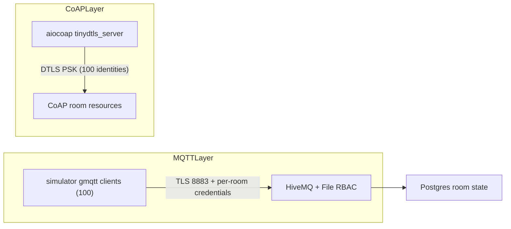

# Operations and Security Runbook

This runbook is the canonical guide for operating the IoT campus stack securely.
It covers:

- First-time setup from a fresh clone.
- Daily startup and shutdown procedures.
- Security controls (MQTT TLS + HiveMQ File RBAC + CoAP DTLS PSK).
- Verification and negative tests.
- Secret/certificate rotation and troubleshooting.

Use this document together with:
- [DOCKER_COMMANDS.md](../DOCKER_COMMANDS.md)
- [MANUAL_TESTING.md](../MANUAL_TESTING.md)
- [config/hivemq/README.txt](../config/hivemq/README.txt)

## 1) Scope and Architecture

This repo runs a multi-service stack with Docker Compose:

- `postgres` (simulator DB, host `5433`)
- `postgres-tb` (ThingsBoard DB, internal)
- `hivemq` (custom image with File RBAC extension, host `1883` and `8883`)
- `simulator` (200 rooms total; MQTT rooms + CoAP rooms)
- `thingsboard` (UI on host `9090`)
- `gateway-floor-01..10` (Node-RED floor gateways)

Security model (default profile):

- MQTT clients connect over TLS to `8883`.
- MQTT auth is per-room user/password loaded from generated secrets.
- HiveMQ File RBAC restricts each room user to its own topic subtree plus explicit fleet heartbeat publish.
- CoAP server runs DTLS (PSK) on container `5684` (host `5694/udp`).



## 2) Prerequisites

Install the following on your host:

- Docker Desktop (or Docker Engine + Compose plugin)
- Python 3 (for secret generation script)
- OpenSSL
- Java `keytool` (for broker keystore generation)
- Optional but recommended for verification:
  - `mosquitto` CLI tools
  - `jq`

macOS example:

```bash
brew install python openssl openjdk mosquitto jq
```

## 3) Security Artifacts and What Gets Generated

### Certificate and keystore generation

Run:

```bash
./scripts/gen_broker_keystore.sh
```

Generated under `config/certs/`:

- `broker.jks` (HiveMQ TLS listener keystore)
- `ca.crt` (simulator MQTT trust anchor)
- `server.key`, `server.crt`, `server.p12` (generated material)

Notes:

- Keystore password defaults to `changeit` unless `HIVEMQ_KEYSTORE_PASS` is set.
- Do not commit keystores or private keys.

### Node credentials and RBAC generation

Run:

```bash
python scripts/generate_campus_secrets.py
```

Generated artifacts:

- `config/secrets/mqtt_nodes.json` (100 MQTT room users/passwords)
- `config/secrets/coap_psk.json` (100 CoAP PSK identities/keys)
- `config/hivemq/extensions/hivemq-file-rbac-extension/conf/credentials.xml` (HiveMQ File RBAC users/roles/permissions)

The script also prints a one-time `campus_observer` user/password for broad host-side testing on `campus/b01/#`.

### Git hygiene

The repository ignores generated security files (`.gitignore`), including:

- `config/secrets/*.json`
- `config/hivemq/extensions/hivemq-file-rbac-extension/conf/credentials.xml`
- `.env`

Never commit generated credentials or local `.env` secrets.

## 4) First-Time Setup (Fresh Clone)

Run all commands from repository root.

### Step 1: Prepare environment template

```bash
cp .env.example .env
```

Why:

- Compose reads `.env` for variable substitution.
- Simulator service also declares `.env` as optional `env_file`.

### Step 2: Generate TLS material for HiveMQ

```bash
./scripts/gen_broker_keystore.sh
```

Confirm these files exist:

```bash
ls -l config/certs/broker.jks config/certs/ca.crt
```

### Step 3: Generate per-node credentials and RBAC file

```bash
python scripts/generate_campus_secrets.py
```

Immediately save the printed `campus_observer` password in a secure local location.

### Step 4: Validate active broker mode

Default secure config is already in:

- `config/hivemq/conf/config.xml` (contains both `mqtt-plain` and `mqtt-tls` listeners)

If you must run without TLS temporarily, use:

```bash
cp config/hivemq/conf/config.plain-only.xml config/hivemq/conf/config.xml
```

and update `.env`:

- `MQTT_USE_TLS=false`
- `MQTT_BROKER_PORT=1883`

### Step 5: Build and start stack

```bash
docker compose up --build -d
```

### Step 6: ThingsBoard one-time database initialization

Wait until `postgres-tb` is healthy, then run:

```bash
docker compose run --rm -e INSTALL_TB=true -e LOAD_DEMO=false thingsboard
docker compose up -d thingsboard
```

### Step 7: Validate healthy startup

```bash
docker compose ps
docker compose logs --tail=200 simulator
docker compose logs --tail=200 hivemq
```

Expected indicators:

- simulator connected to PostgreSQL
- many MQTT client connection logs
- CoAP DTLS server listener startup (`5684`)
- HiveMQ starts with mounted File RBAC credentials

## 5) Daily Startup and Shutdown

### Start (normal)

```bash
docker compose up -d
```

### Start (foreground)

```bash
docker compose up
```

### Rebuild when needed

Use `--build` when any of these changed:

- `Dockerfile`, `requirements.txt`
- `Dockerfile.hivemq`
- HiveMQ extension config under `config/hivemq/extensions/...`
- base image-related dependencies

```bash
docker compose up --build -d
```

### Logs and status

```bash
docker compose ps
docker compose logs -f simulator
docker compose logs -f hivemq
```

### Stop / teardown

```bash
docker compose down
```

Remove volumes only when you intentionally want to wipe persisted state:

```bash
docker compose down -v
```

## 6) Security Verification and Negative Tests

## MQTT TLS positive test (room-scoped user)

Pick room `b01-f01-r101` and extract credentials:

```bash
export MQTT_USER=$(jq -r '.nodes[] | select(.room_id=="b01-f01-r101") | .username' config/secrets/mqtt_nodes.json)
export MQTT_PASS=$(jq -r '.nodes[] | select(.room_id=="b01-f01-r101") | .password' config/secrets/mqtt_nodes.json)
```

Subscribe to room topic over TLS:

```bash
mosquitto_sub -h localhost -p 8883 --cafile config/certs/ca.crt -u "$MQTT_USER" -P "$MQTT_PASS" -t 'campus/b01/f01/r101/telemetry' -C 1
```

### MQTT ACL negative test (cross-room denied)

Try reading another room using room-101 credentials:

```bash
mosquitto_sub -h localhost -p 8883 --cafile config/certs/ca.crt -u "$MQTT_USER" -P "$MQTT_PASS" -t 'campus/b01/f02/r201/telemetry' -W 5
```

Expected: no authorized data for unrelated room scope (or explicit authorization failure depending on client behavior).

### MQTT wrong password negative test

```bash
mosquitto_sub -h localhost -p 8883 --cafile config/certs/ca.crt -u "$MQTT_USER" -P 'wrong-password' -t 'campus/b01/f01/r101/telemetry' -W 5
```

Expected: authentication failure.

### Broad testing user (`campus_observer`)

Use only for host-side verification, not simulator clients.
This user is printed when running `generate_campus_secrets.py`.

### CoAP DTLS test

The simulator’s secure mode exposes DTLS at host `5694/udp`.
Use a CoAP client that supports DTLS PSK and configure identity/key from `config/secrets/coap_psk.json` for the target room.

Plain CoAP (`coap://` on 5683) is debug mode only and requires `phase2.coap.dtls_enabled=false`.

### Quick DB sanity check

```bash
docker compose exec -T postgres psql -U iot_user -d iot_campus -c "SELECT COUNT(*) AS room_count FROM room_states;"
```

Expected steady-state count: `200`.

## 7) Configuration Change Operations

Two common configuration layers:

- `.env` (compose/runtime overrides)
- `config/config.yaml` (simulator defaults)

The simulator mounts `./config:/app/config`, so file changes apply in container filesystem immediately, but process restart is usually required for runtime reload:

```bash
docker compose restart simulator
```

If broker listener or RBAC config changes:

```bash
docker compose restart hivemq
```

If image-level dependencies change, rebuild:

```bash
docker compose up --build -d
```

## 8) Secret and Certificate Rotation

### Rotate MQTT/CoAP credentials

```bash
python scripts/generate_campus_secrets.py
docker compose restart hivemq simulator
```

Why both:

- HiveMQ reads updated RBAC credentials.
- Simulator reconnects using new per-room credentials and PSKs.

### Rotate broker certificate

```bash
./scripts/gen_broker_keystore.sh
docker compose restart hivemq simulator
```

After CA rotation, any external MQTT client must trust updated `ca.crt`.

### Team handling

- Share generated credentials only via approved secure channels.
- Never paste long-lived secrets into issue trackers or committed docs.

## 9) Troubleshooting

### HiveMQ fails on startup with TLS listener errors

Check:

- `config/certs/broker.jks` exists
- keystore password matches broker config (default `changeit` in current config)

Inspect:

```bash
docker compose logs --tail=200 hivemq
```

### File RBAC appears inactive

Check:

- `credentials.xml` exists before startup
- bind mount path is correct:
  - host: `config/hivemq/extensions/hivemq-file-rbac-extension/conf/credentials.xml`
  - container: `/opt/hivemq/extensions/hivemq-file-rbac-extension/conf/credentials.xml`

### MQTT TLS enabled but simulator cannot connect

Check:

- `.env` has `MQTT_USE_TLS=true`, `MQTT_BROKER_PORT=8883`
- `MQTT_TLS_CAFILE` points to `/app/config/certs/ca.crt`
- `ca.crt` exists in `config/certs/`

### CoAP DTLS not reachable

Check:

- simulator logs for DTLS listener startup (if you saw `The transport can not be bound to any-address`, that was fixed by resolving `0.0.0.0` to the container’s primary IPv4 for `tinydtls_server`; rebuild the simulator image)
- compose UDP mapping `5694:5684/udp`
- `COAP_DTLS_ENABLED=true` (or default from config)
- PSK file exists and has expected room identity/key

### Build failures around aiocoap/tinydtls

Simulator Dockerfile already includes build dependencies used for `aiocoap[tinydtls]`.
If this regresses, rebuild with full logs:

```bash
docker compose build --no-cache simulator
```

## 10) Operational Checklist

Use this short checklist at each new environment bootstrap:

1. `cp .env.example .env`
2. `./scripts/gen_broker_keystore.sh`
3. `python scripts/generate_campus_secrets.py`
4. `docker compose up --build -d`
5. Run ThingsBoard one-time DB init command
6. Verify simulator + HiveMQ logs
7. Run MQTT TLS positive and negative ACL tests
8. Save rotation date and owner in your internal ops tracker
