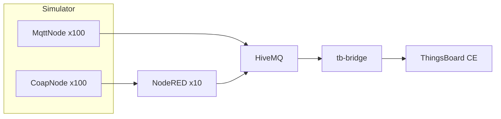

# Phase 2 — Hybrid MQTT/CoAP Campus Stack (Report Template)

This document is the submission-ready skeleton for SWAPD453 Phase 2. Embed screenshots and log excerpts where indicated.

## 1. Architecture

- **Simulator**: 200 logical rooms in one asyncio process — 100 `gmqtt` clients (MQTT rooms) + 100 `aiocoap` servers (CoAP rooms), per-floor split (rooms 1–10 CoAP, 11–20 MQTT).
- **HiveMQ CE**: TLS on `8883`, file-RBAC users from `scripts/gen_credentials.py`.
- **Node-RED**: 10 floor gateways; CoAP observe → MQTT republish; MQTT `cmd` → CoAP PUT for CoAP rooms; `60s` floor summaries.
- **ThingsBoard CE**: 200 devices + asset tree via `scripts/provision_tb.py`. **CE has no external-broker MQTT integration**; `tb-bridge` (`scripts/tb_hivemq_bridge.py`) subscribes on HiveMQ and POSTs telemetry to TB over the tenant REST API.



## 2. HiveMQ Control Center

**Screenshot placeholder**: open `http://localhost:8080` — show connected clients (expect admin + 100 MQTT room clients + gateways + `tb-bridge` + benchmarks).

## 3. Round-trip latency

Run:

```bash
MQTT_PASSWORD_SECRET=... python scripts/rtt_benchmark.py --n 100 --mixed
```

**Table placeholder** — copy p50 / p95 / p99 / max from script output. Target: p99 under 500 ms under declared load.

| Metric | Value (ms) |
|--------|------------|
| p50    |            |
| p95    |            |
| p99    |            |
| max    |            |

CSV output: `perf_logs/rtt_samples.csv`.

## 4. Duplicate command handling (DUP / dedup)

Run:

```bash
ADMIN_MQTT_USER=admin ADMIN_MQTT_PASSWORD=... MQTT_PASSWORD_SECRET=... \
  python scripts/dup_replay.py --room b01-f05-r512
```

**Log excerpt placeholder**: one `dup_drop` line from the simulator when replaying the same `command_id`.

## 5. TLS / security

**Placeholder**: `openssl s_client -connect localhost:8883 -CAfile config/certs/ca.crt` (or from inside Docker network: `hivemq:8883`) — paste handshake confirmation.

CoAP: document DTLS vs plaintext per `config/config.yaml` (`coap.dtls_enabled`).

## 6. Soak test / performance

Run `./performance.sh` — collects simulator stats, latency grep, and HiveMQ `docker stats` snapshots in `perf_logs/`.

**Placeholder**: 30-minute event-loop latency line from `simulator.log` (existing monitor in `simulator/main.py`).

## 7. Known gaps

- ThingsBoard **Community Edition** does not include PE “MQTT integration”; ingestion uses `tb-bridge` + REST instead.
- If DTLS for CoAP is disabled or falls back to plaintext, state that explicitly and cite `CoapNode` logs.

## 8. Wokwi (carryover)

`wokwi_code.py` remains Phase 1 style; a stretch goal is TLS to the local HiveMQ broker instead of a public plaintext endpoint.

## 9. Exporting ThingsBoard entities

After configuring dashboards/rule chains in the UI:

```bash
TB_URL=http://localhost:9090 TB_USER=tenant@thingsboard.org TB_PASS=tenant \
  python scripts/export_tb.py
```

Artifacts land in `config/thingsboard/provisioning/`.
